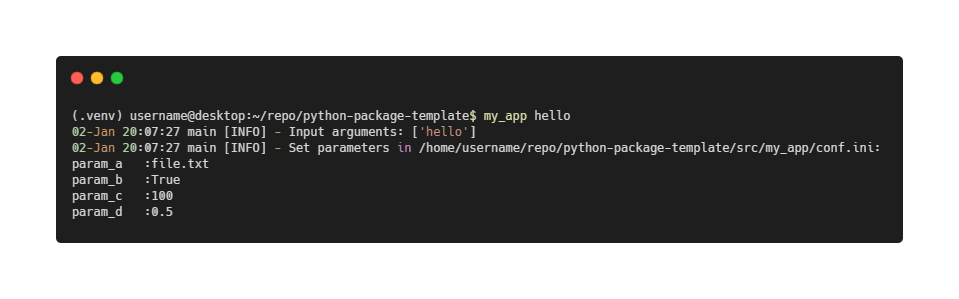

# Simple Python project template 2022

Features: 
* `pyproject.toml` with PEP621 (new style metadata)
* `my_app.utils` example package with standard logging and configuration methods
* `__main__.py` entrypoint with `my_app.__main__:main` as console script  
* `pytest` for testing
* `pip` for installation interface
* `build` for packaging and distribution 
* `setuptools>=61.0` for build backend

How to use (Linux):
1. Copy template and cd to the directory    
`cd /python-project-template-2022`
2. Create a virtual environment    
`python3 -m venv .venv`
3. Activate the virtual environment     
`source .venv/bin/activate`

4. Upgrade pip and setuptools   
`pip install pip setuptools --upgrade`

4. Start develop mode (pip editable mode/ editable install). This will also install the dependencies specified in `pyproject.toml`.   
`python3 -m pip install -e .`

5. Test the console command     
`my_app hello`

6. Run a test. The test is run against the current editable install outside the code.   
`pytest -sv`

7. Build distribution packages (tarball and wheels)  
`python3 -m build`

 

Tips:
* Disable pip install on your global environment     
`pip config set global.require-virtualenv True`

